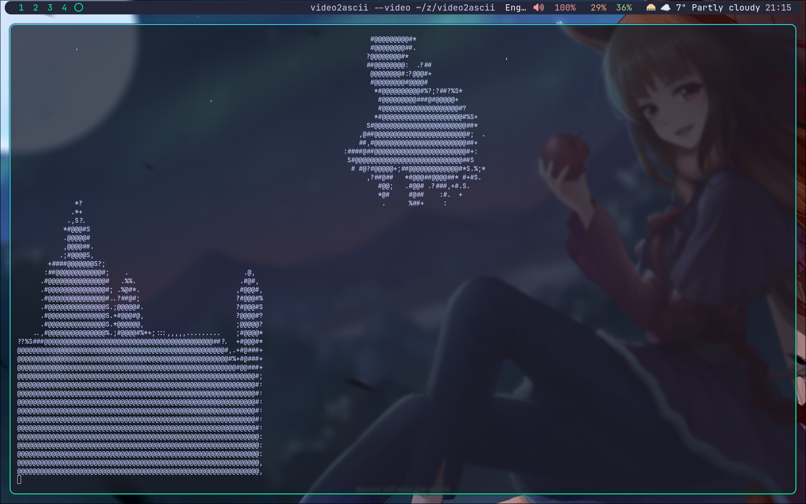

# VIDEO2ASCII

Добро пожаловать в репозиторий моей первой лабораторной работы\! Здесь я тренируюсь оформлять документацию красиво и понятно. 🚀

## 📋 План выполнения работы

1.  **Подготовка окружения**:
      * Установка текстового редактора.
      * Настройка профиля на GitHub.
2.  **Изучение синтаксиса**: Разбор заголовков, списков и ссылок.
3.  **Создание структуры проекта**: Написание кода и оформление папок.
4.  **Работа с медиафайлами**: Добавление скриншотов и внешних ссылок.
5.  **Финальный коммит**: Проверка орфографии и публикация.

-----

## 🛠 Технические характеристики

Ниже представлена таблица с инструментами, которые использовались в процессе:

| Инструмент | Версия | Назначение |
| :--- | :---: | :--- |
| VS Code | 1.85 | Написание текста |
| Git | 2.40 | Контроль версий |
| Browser | Latest | Проверка рендеринга |

-----

## 🖼 Пример работы

-----

## 💡 Полезная информация

  * **Важное правило:** Никогда не забывайте делать `git push` в конце дня\!
  * **Стиль текста:** В этой работе мы использовали *курсив*, **жирное начертание** и даже `моноширинный шрифт` для кода.
  * **Интересный факт:** Markdown был создан, чтобы его было легко читать даже в сыром виде.

А если тебе станет скучно во время учебы, загляни на страницу этого шедевра:  
[Мой любимый фильм](https://yandex.ru/video/preview/6955355344063203321?text=Мстители&path=yandex_search&parent-reqid=1776191431509393-13198889457639239196-balancer-l7leveler-kubr-yp-vla-243-BAL&from_type=vast) 🎬 *(Осторожно: вызывает желание пересматривать снова и снова\!)*
